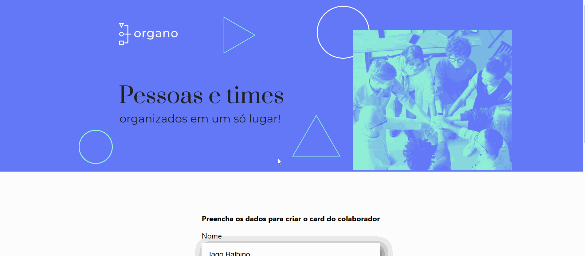

# Alura - Organo

Este projeto foi desenvolvido durante o curso "React: desenvolvendo com JavaScript"

## Conteúdo

- [Overview](#overview)
  - [O desafio](#o-desafio)
  - [Screenshot](#screenshot)
  - [Links](#links)
- [Meu processo](#meu-processo)
  - [Construído com](#construído-com)
  - [O que aprendi](#o-que-aprendi)
  <!-- - [Recursos úteis](#recursos-úteis) -->
- [Autor](#autor)

## Overview

### O desafio

Desenvolver um SPA utilizando React.js.

### Screenshot



### Links

- URL do projeto: [https://iagobalbino.github.io/organo/](https://your-solution-url.com)
- Meu Site: [https://iagobalbino.com.br/](https://iagobalbino.com.br/)

<!-- ## Meu processo -->

### Construído com

- React.js
- CSS
- Javascript

### O que aprendi

Neste projeto utilizei alguns dos fundamentos do React JS, entre eles o hook use state, que foi necessário para realizar a adição dos membros dinamicamente na tela.

<!-- 
```html
        <div class="prices">
          <p class="main-price">$149.99</p>
          <p class="old-price">$169.99</p>
        </div>
```
```css
.prices {
  display: flex;
  align-items: center;
  margin-bottom: 20px;
}

.main-price,
.old-price {
  display: inline;
}
``` -->

<!-- ### Recursos úteis

- [Guia Origamid Flex Box](https://origamid.com/projetos/flexbox-guia-completo/) - Me ajudou a lembrar a sintaxe e as funcionalidades do flex box -->

## Autor

- Website - [Iago Balbino](https://iagobalbino.com.br/)
- Alura - [www.alura.com.br](https://www.alura.com.br)
